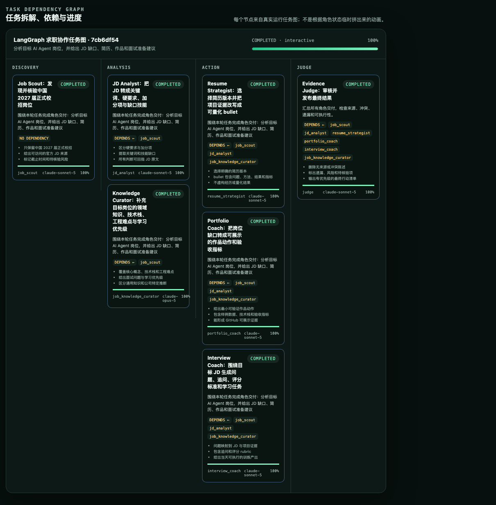
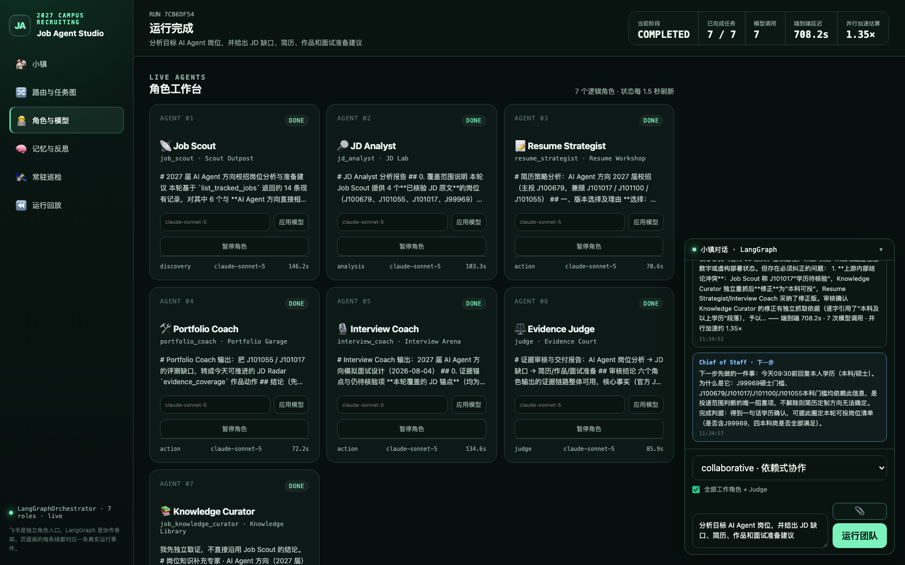
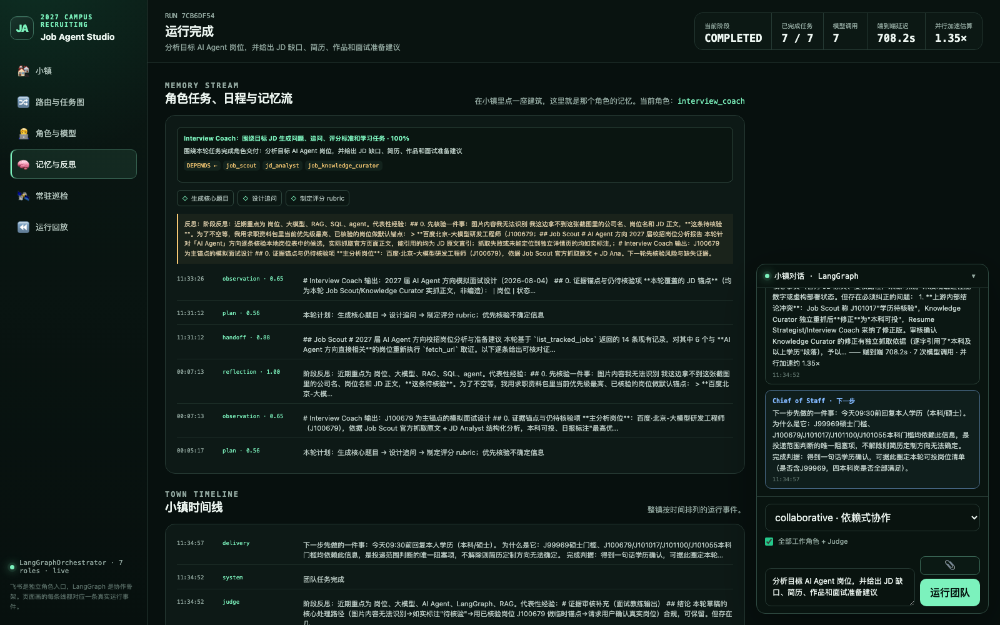
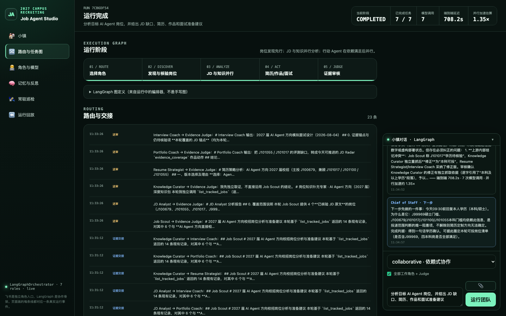
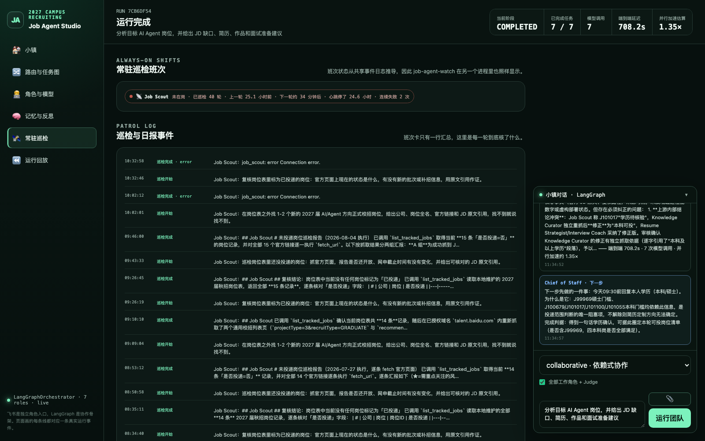
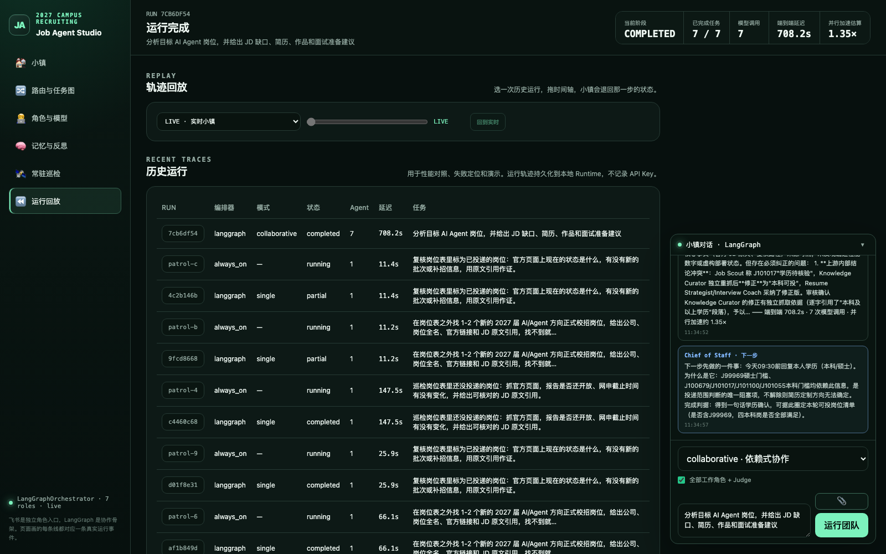

# Job Agent Studio

一个面向 2027 届秋招的、可审计的 Multi-Agent 求职系统。

飞书只负责消息入口和交互展示；模型推理走 Anthropic 官方 SDK 调 Claude
（Knowledge Curator 用 Claude 5），也保留一条 OpenAI-compatible 的自建端点旁路。
项目不会调用飞书 AI。


上图是真实运行 `7cb6df54` 的终态，不是设计稿也不是预录动画：7 个角色全部完成、
端到端 708.2s、7 次模型调用、并行加速比 1.35×。橙色连线是 `handoff_created`
事件里真实的证据交接方向，右侧是 Judge 本轮的实际审核结论。

**页面拿不出对应 `ActivityEvent` 的连线，页面就不画。** 这条规则贯穿整个前端，
也是这个项目和「跑起来很好看的 Agent Demo」之间的区别。

## 亮点

1. **可审计的运行轨迹，而不是动画**。每个角色状态、每条依赖、每次交接都由持久化的
   `ActivityEvent` 和任务图驱动。可以选任意历史 run 按事件时间步回放到那一刻的状态，
   页面不显示未来事件。
2. **Judge 真的会推翻上游结论**。上图那次运行里，Job Scout 判定岗位 J101017
   「学历待核验」，Knowledge Curator 独立重抓官方页面后**修正为「本科可投」**，Judge
   核实该修正有逐字引用依据后采信，并把这个上游冲突写进交付报告。多 Agent 的价值在
   这里是可复现的，不需要靠人相信。
3. **检索质量有可回归的量化基线**。定位出三个根因——对称归一化让检索分数与信息量反
   相关、40% 语料是模板化记账、近重复反思霸占全部检索槽位——修复后真实语料 12 个案例
   `k=4`：`hit@4` 0.000 → **1.000**，`precision@4` 0.000 → **0.854**，
   `boilerplate@4` 1.000 → **0.000**。基线可重跑，不靠「看起来还行」。
4. **读取路径不随运行时长退化**。`ActivityStore.read` 从文件尾反向按块读取，
   `MemoryStore.list_by_role` 把七次全文件解析合并成一次；
   `GET /api/town` 58 ms → **19.9 ms**。
5. **角色是数据，不是硬编码的图节点**。网页或 API 一键新增角色，`workflow_stage`
   决定它在 DAG 里的位置，不改代码也不重启。
6. **分角色模型分层**。Knowledge Curator 跑 `claude-opus-5`，其余角色跑
   `claude-sonnet-5`；任务图截图里能直接看到每个节点用的哪个模型，网页可热改做 A/B。
7. **失败被记录而不是被藏起来**。超时、`Connection error.`、连续失败次数都进事件流并在
   页面上显示；单个角色失败不阻塞整体，Judge 可基于已完成结果生成部分报告。
8. **零构建前端**。`web/` 是静态文件，由 FastAPI 直接挂载，没有 npm/Vite/TypeScript
   步骤，启动命令只有 `uv run job-agent-api`。
9. **255 个单元测试**，全部使用 Mock Model，不消耗模型额度。

## 界面

六个页面都记在 URL hash 里，`#patrol` 这样的链接可以直接发给别人。

### 任务拆解、依赖与进度



每个节点来自真实运行的任务图：`DEPENDS ←` 是实际依赖，中间三条是该角色的验收条件，
底部是真实使用的模型与进度。`job_knowledge_curator` 用 `claude-opus-5`、其余用
`claude-sonnet-5`，这就是分角色模型分层最直接的证据。

### 角色工作台



七个逻辑角色状态每 1.5 秒刷新，每张卡显示阶段、模型和真实耗时，可就地改模型或暂停角色。

### 记忆与反思



每个角色持久化 observation / handoff / plan / reflection 四类记忆并带重要度，下一次执行
按相关性、重要度与新近度检索并注入上下文。`plan` 不参与检索——它由 `RoleSpec.schedule`
在角色动手之前生成，只能复述 system prompt 已有的静态配置，却占了真实语料的 40%。

### 路由与证据交接



`证据交接` 和 `送审` 是两类不同的真实事件：前者是 context 阶段角色把证据交给 action
阶段角色，后者是六个角色把结果送给 Judge。

### 常驻巡检



Job Scout 不等 `@` 也在干活，每 15 分钟核验一轮真实岗位。这张图里 40 轮巡检、2 次连续
失败和真实的 `Connection error.` 都如实显示——可观测性的意义就是失败也要看得见。

### 轨迹回放



历史运行按编排器、模式、状态、Agent 数和延迟列出，用于性能对照、失败定位和演示。
早期的一次 `portfolio_coach` 回放截图见
[`docs/assets/agent-town-replay.jpg`](docs/assets/agent-town-replay.jpg)。

## 核心能力

- 角色注册表：通过网页/API 一键添加角色，无需改代码或重启服务。
- 动态路由：只选择与当前任务相关的角色，避免所有 Agent 每次都运行。
- 分阶段协作：岗位侦察先核验机会，JD 与岗位知识再并行分析；简历、作品与面试
  Agent 等依赖满足后并行执行。
- 审核闭环：Judge 汇总结果并保留角色输出、耗时和 token 证据。
- 分角色模型：每个角色可通过环境变量或网页/API 单独覆盖模型；Knowledge Curator 可用
  更强模型，其他角色保留低延迟模型，支持单 Agent、多 Agent 和模型 A/B。
- 飞书接入：使用飞书官方 Python SDK 的长连接模式，不要求飞书 AI。
- 飞书富文本：模型结果、角色列表和日报用 Feishu Post/Markdown 展示，支持标题、
  列表、代码和可点击 JD 链接。
- 独立角色机器人：一个后端可同时连接多个飞书应用，让群成员分别
  `@Job Scout`、`@Resume Strategist` 或 `@Portfolio Coach`。
- 日报直达与拆解：总控先发送结构化求职总报和新增岗位工作流，再由七个角色分别
  推送岗位、JD、学习、简历、作品、面试和证据审核内容。
- 双编排器：默认使用 LangGraph 状态图；保留轻量 `asyncio` Harness 作为性能
  baseline 和故障降级。
- 实时控制台：侧边栏六个页面（小镇 / 路由与任务图 / 角色与模型 / 记忆与反思 /
  常驻巡检 / 运行回放）展示 route/discovery/analysis/action/judge、每个 Agent 的
  模型、任务详情、依赖、验收条件、进度、延迟、输出摘要与最近运行；页面记在
  URL hash 里，`#patrol` 这样的链接可以直接发给别人。
- RPG 求职小镇：Phaser 3 全屏瓦片小镇，7 个角色拥有独立建筑和精灵，沿 LangGraph
  阶段道路连线；不是预录动画，位置、气泡、状态、日程、记忆流、证据交接和延迟均
  来自 `ActivityEvent`。前端零构建——`web/` 是静态文件，由 FastAPI 直接挂载，
  没有 npm/Vite/TypeScript 步骤，启动命令仍然只有 `uv run job-agent-api`。
- 真实轨迹回放：选择历史 run 并按事件时间步回放 Plaza 调度、Agent 工作、
  context → action 交接与 Judge 审核，不显示未来事件或伪造活动。
- 生成式认知层：每个角色持久化 observation、handoff、plan 和 reflection；
  下一次执行按相关性、重要性与新近度检索长期记忆并注入角色上下文。
- 一键角色模板：网页可立即添加生信、数据科学或 Agent 评测角色，也可自定义
  `workflow_stage`、建筑、图标、日程并即时启停，无需重启。
- 角色日报：配置独立机器人后，七个角色分别推送自己负责的岗位、JD、学习、简历、
  作品、面试和审核内容。
- 实时模拟面试：`@Interview Coach` 后用 `/mock` 进入一问一答的多轮面试，教练每轮给
  0-10 分和改进建议，回答可以直接发语音（飞书 STT 转写），教练也可以用语音出题。

## 架构

```text
Feishu Bot / Web UI
        |
Channel Adapter
        |
Deterministic Router
        |
Role Registry -> Job Scout -> JD + Knowledge -> Resume + Portfolio + Interview
        |              \________ user model API _________/              |
   role/model config                                      Judge -> Run Report
```

详细设计与开源调研见
[`docs/architecture.md`](docs/architecture.md)。
飞书后台配置、容器部署和验收步骤见
[`docs/feishu-deployment.md`](docs/feishu-deployment.md)。
多角色独立机器人身份见
[`docs/feishu-multi-bot.md`](docs/feishu-multi-bot.md)。
RPG 小镇的状态映射和演示方式见
[`docs/rpg-agent-town.md`](docs/rpg-agent-town.md)。
瓦片素材与前端库的来源和许可见
[`docs/asset-credits.md`](docs/asset-credits.md)。
编排开销、真实七角色运行与模型 A/B 见
[`docs/performance-report.md`](docs/performance-report.md)。
2026-07-28 的 8 Bot、分角色日报、真实 `@Portfolio Coach` 与 RPG 回放验收见
[`docs/acceptance-2026-07-28.md`](docs/acceptance-2026-07-28.md)。
2026-07-30 的任务依赖图、角色模型、总控日报和真实 `@Knowledge Curator` 验收见
[`docs/acceptance-2026-07-30.md`](docs/acceptance-2026-07-30.md)。
2026-08-03 的实时模拟面试、语音转写与语音出题验收见
[`docs/acceptance-2026-08-03.md`](docs/acceptance-2026-08-03.md)。

## 本地启动

```bash
uv sync --extra dev
cp .env.example .env
uv run job-agent-api
```

打开 `http://127.0.0.1:8000`，默认落在小镇页；侧边栏切页会写入 URL hash，
可以直接访问 `#graph`、`#roles`、`#memory`、`#patrol`、`#replay`。
未配置模型 API 时，API 会明确报配置缺失；
单元测试使用 Mock Model，不消耗模型额度。

飞书 Bot 使用长连接启动：

```bash
export LARK_APP_ID=cli_xxx
export LARK_APP_SECRET=...
export ANTHROPIC_API_KEY=...
uv run job-agent-feishu
```

Job Scout 不等 `@` 也在干活：常驻巡检每 15 分钟跑一轮真实岗位核验，心跳写进
`ActivityEvent`，小镇和 `/api/always-on` 都能看到它上一次工作是几秒前。

```bash
uv run job-agent-watch                      # 独立进程跑常驻巡检
curl -s localhost:8000/api/always-on        # 看在不在岗、上轮几秒前、连续失败几次
bash scripts/install_macos_always_on.sh     # 注册 launchd，合上电脑继续跑
```

API 服务自己也会起同一个巡检（`lifespan`），两边抢同一把文件锁，所以同时开着也
不会跑双份。合盖不睡眠还需要一次
`scripts/clamshell-work.sh enable`（要 sudo，且建议接电源）。

飞书内可直接使用：

```text
/help
/roles
/group-create
/daily
/daily 2026-07-26
/daily full
/knowledge 补充这个岗位的 RAG、Agent Evaluation 与工程化知识
/job 分析这个 2027 届 AI Agent 岗位
/apply 根据这份 JD 生成简历与作品调整建议
/interview 根据这份 JD 制定面试准备
/mock start 百度 Agent应用全栈 J99974 语音 6轮
/mock status
/mock skip
/mock end
/team 为这个目标岗位执行完整求职准备
/ask job_knowledge_curator 什么是 Agent golden set，如何做评测
/agent portfolio_coach 把这个岗位缺口转成一个可展示的 MVP
/role-add {"role_id":"bioinformatics_coach","display_name":"生信算法教练","goal":"把生信岗位要求映射到可验证的项目证据","system_prompt":"只依据用户提供的岗位和项目证据输出，不虚构指标。","trigger_keywords":["生信","GWAS","单细胞"]}
```

普通消息会按关键词自动选择角色并行执行；`/agent <role_id> <任务>` 可显式指定
一个角色，`/ask` 是更直观的同义命令。`/job`、`/apply`、`/interview` 和 `/team`
使用分阶段协作模式。
直接点名一个角色时，系统保留该专家的完整回答，再追加 Judge 的证据审核；Judge
不会再用短摘要替换角色正文。消息合并层会自动闭合未成对的 Markdown 代码围栏，
避免飞书中的后续标题被吞进代码块。
网页端的“添加并立即启用”表单和 `/role-add` 共用同一个角色注册表。
新增角色不只是一个名称：`workflow_stage=context` 会在上游证据阶段运行，
`workflow_stage=action` 会接收 context Agent 的证据交接；角色的建筑、图标、
日程和启停状态也会立即同步到小镇。

首次部署时，在与总控机器人“Chief of Staff”的单聊中发送
`/group-create`，即可创建私有“AI 求职 Agent 小镇”群，把发起人设为群主、加入
总控与已配置的角色机器人，并把后续日报目标切换到该群。命令可重复执行而不会重复
建群；总控需要额外开通 `im:chat:create` 和
`im:chat.members:write_only`。

## 实时模拟面试（可语音）

在群里 `@Interview Coach`，或在与它的单聊中直接发命令：

```text
/mock start 百度 Agent应用全栈 J99974 语音 6轮
```

教练每次只问一道题；你回答后它先给 `评分：x/10` 和具体改进建议，再出下一题，最后
一轮结束时输出总评、平均分和逐题得分。会话状态持久化在
`<JOB_AGENT_DATA_DIR>/interviews/`，所以飞书每条消息都是独立回调也不会丢上下文；
超过 6 小时没动静的会话自动作废，不会再抢走你的普通提问。

- `语音`：本轮回答和出题都走语音（也可写 `文字` 强制关闭）
- `N轮`：本场计划轮数，默认 5 轮，最多 12 轮
- `/mock skip` 跳过本题、`/mock status` 看进度、`/mock end` 立即收尾复盘

语音链路的三个前提：

1. Interview Coach 那个飞书自建应用需要 `speech_to_text:speech`（听懂你的语音回答）。
2. 同一个应用还需要 `im:resource:upload`（上传教练的语音出题）；缺这一项时文字
   问答完全正常，只有语音被飞书拒绝。
3. 教练的语音出题需要本机有 opus 编码器：

```bash
brew install ffmpeg        # 或 brew install opus-tools
```

三种缺失都不会丢掉这一轮问答，只是降级成文字版，并在该会话里按原因各提示一次。
出题内容
来自 `prepare/interview/mock_interview_bank.md`（按真实 JD、主线书和本项目实现
组织，未核实的公司真题一律标「通用模拟」）。

没进入 `/mock` 会话时，`@Interview Coach <问题>` 仍然走原来的单角色 + Judge 流程。

长期记忆可通过 API 审计：

```bash
curl http://127.0.0.1:8000/api/agents/jd_analyst/memories
curl --get http://127.0.0.1:8000/api/agents/jd_analyst/memories/search \
  --data-urlencode 'query=Agent Evaluation golden set'
```

检索本身有可回归的量化基线，不靠“看起来还行”：

```bash
uv run python benchmarks/eval_memory_retrieval.py
```

golden set 由语料中重复出现的岗位 ID 自动构造，所以相关性是可判定的谓词。真实语料
12 个案例、k=4 下，修复稀释相关度、样板污染和近重复霸榜之后：hit@4 由 0.000 升到
1.000，precision@4 由 0.000 升到 0.854，boilerplate@4 由 1.000 降到 0.000；
recall@4 为 0.156，而 k 决定的算术上限是 0.196。细节见
[`docs/architecture.md`](docs/architecture.md) 与
[`benchmarks/README.md`](benchmarks/README.md)。

如果希望在群里直接使用不同机器人名称，可为每个 role 创建独立飞书自建应用，并
把 App ID/App Secret 通过环境变量绑定到 role。所有身份仍由同一个进程托管：

```dotenv
JOB_AGENT_FEISHU_ROLE_BOTS=job_scout,jd_analyst,resume_strategist
LARK_ROLE_JOB_SCOUT_APP_ID=cli_xxx
LARK_ROLE_JOB_SCOUT_APP_SECRET=...
LARK_ROLE_JD_ANALYST_APP_ID=cli_xxx
LARK_ROLE_JD_ANALYST_APP_SECRET=...
LARK_ROLE_RESUME_STRATEGIST_APP_ID=cli_xxx
LARK_ROLE_RESUME_STRATEGIST_APP_SECRET=...
```

配置后启动命令仍是 `uv run job-agent-feishu`。入口进程会为总控和每个角色启动
独立 WebSocket worker，隔离飞书 SDK 的事件循环、连接故障与重连状态；普通消息会
直接进入该机器人绑定的 role，再由 Judge 复核。总控机器人继续负责自动路由和
`/team` 等团队命令。

生产默认由 LangGraph 编排：
`route → discovery → analysis → action → judge`；岗位侦察先执行，JD/知识与
简历/作品/面试分别在两个并行层中运行。Pydantic 定义输入输出和任务 DAG，
FastAPI 提供 API/UI，
飞书官方 `lark-oapi` SDK 提供长连接，Anthropic 官方 `anthropic` SDK 调 Claude
（`web_search_20260209` / `web_fetch_20260209` 服务端联网工具，网关不支持时自动
降级到本地 Tool Executor）。
要做公平性能对照时可切回 baseline：

```bash
JOB_AGENT_ORCHESTRATOR=asyncio uv run job-agent-feishu
```

自动化结束后可把当天具体内容直接推到最近一次使用机器人的飞书会话：

```bash
uv run job-agent-push-daily
uv run job-agent-push-daily --date 2026-07-26 --full
uv run job-agent-push-daily --role portfolio_coach
uv run job-agent-push-daily --controller
```

默认行为是：总控先发送综合日报与任务拆解，再由已配置的每个角色机器人向同一会话
发送它负责的日报部分；如果还没有独立角色机器人，则退回总控综合摘要。使用
`--roles-only` 可只发送角色分工消息。

上面这条命令不需要每天手敲。`job-agent-api` 和 `job-agent-watch` 启动时都会拉起
每日推送定时器，默认每天 `09:30`（`Asia/Shanghai`）推一次：

```dotenv
JOB_AGENT_DAILY_PUSH=1
JOB_AGENT_DAILY_PUSH_AT=09:30
JOB_AGENT_DAILY_PUSH_TZ=Asia/Shanghai
JOB_AGENT_DAILY_PUSH_MAX_DELAY_HOURS=6
JOB_AGENT_DAILY_PUSH_POLL_SECONDS=120
JOB_AGENT_DAILY_PUSH_RETRY_SECONDS=600
```

它是轮询而不是睡到某一刻：笔记本合盖睡过 09:30，醒来后仍会在
`JOB_AGENT_DAILY_PUSH_MAX_DELAY_HOURS` 的窗口内补推一次，超窗则判定为过期直接跳过
当天（早上的日报晚上送到只是噪音）。已推日期写在
`data/runtime/daily_push_state.json`，所以重启不会重复推；和常驻巡检共用同一种文件
锁，API 进程和 `job-agent-watch` 同时开着也只有一个真的发。当前状态可以直接查：

```bash
curl http://127.0.0.1:8000/api/always-on   # 响应里的 daily_push 字段
```

日报正文原本必须由人先写在 `<prepare>/daily/<YYYY-MM-DD>.md`，那天没写就会推送失败。
现在定时路径会先兜底生成：七个角色按章节各写一段，落到
`data/runtime/daily/<YYYY-MM-DD>.md`，**不会**写进 `prepare/`，所以永远不会顶替或
覆盖人工日报——人工日报存在时优先用它。也可以手动生成或强制重写：

```bash
uv run job-agent-write-daily                       # 缺日报时现场写一份
uv run job-agent-write-daily --date 2026-08-05 --force
uv run job-agent-push-daily --generate             # 缺日报时先写再推
```

这七个 run 带 `RunRequest.origin="schedule"` 标记（巡检是 `"patrol"`，网页/飞书发起
的是 `"user"`）。页面只有一个「当前 run」的位置，没有这个标记的话它们会轮流把用户
正在看的协作 run 顶掉，所以后台 run 只在没有任何真实任务时才上台。

每个角色的模型解析顺序是：

```text
网页/API 的 RoleSpec.model
  > JOB_AGENT_ROLE_MODEL_<ROLE_ID>
  > model_profile 对应的默认模型
```

例如仅给 Knowledge Curator 配置更强模型：

```dotenv
JOB_AGENT_ROLE_MODEL_JOB_KNOWLEDGE_CURATOR=claude-opus-5
```

网页的每张角色卡可以直接修改该角色模型。相同能力也可通过 API 使用：

```bash
curl http://127.0.0.1:8000/api/models
curl -X PATCH http://127.0.0.1:8000/api/roles/job_knowledge_curator \
  -H 'Content-Type: application/json' \
  -d '{"model":"claude-opus-5","timeout_seconds":120}'
curl http://127.0.0.1:8000/api/task-graphs
```

## GitHub 展示与线上运行

GitHub 保存源码、架构图、benchmark 数据和演示 GIF。GitHub Pages 只能托管静态
页面，不能持续运行 Agent 后端；线上 Bot 需要一个常驻 Python 服务，或改用公开
HTTPS webhook 部署到支持后端的服务。

建议交付结构：

1. GitHub：源码、角色模板、benchmark、CI 和演示材料。
2. 飞书自建应用：机器人、消息事件和交互卡片。
3. Runtime：Docker/云服务器/Render/Railway/Fly.io 或妙搭全栈托管。
4. 模型：用户提供的 API，通过环境变量注入。

本仓库附带 `Dockerfile` 和 `compose.yaml`。GitHub 负责代码、CI 与演示材料，
常驻 Bot 由容器平台运行；不依赖妙搭的云端 AI 生成能力。

```bash
# 只运行飞书长连接 Bot
docker compose up --build -d bot

# 同时运行 Bot 和本地 API/UI
docker compose --profile api up --build -d
```
