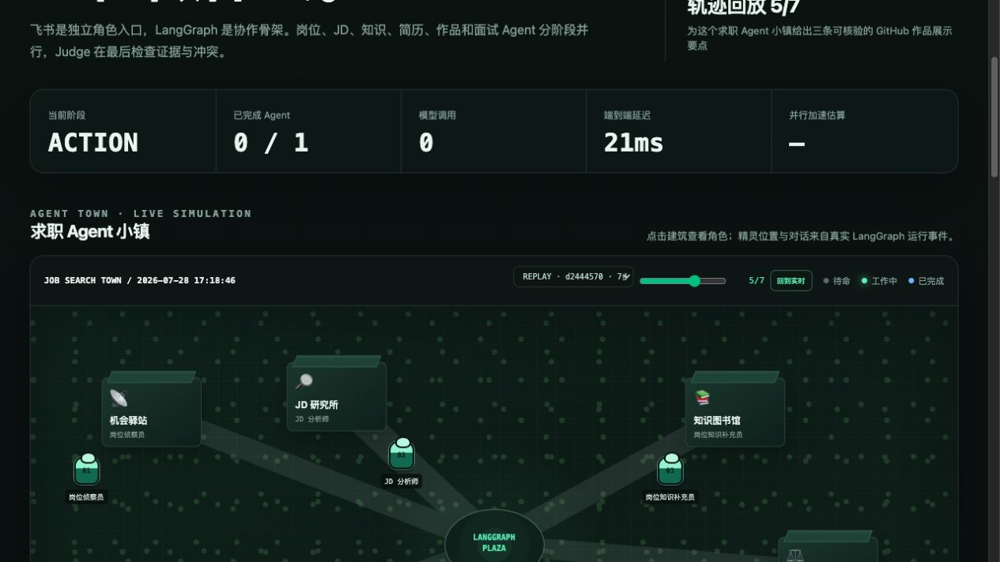

# Job Agent Studio

一个面向 2027 届秋招的、可审计的 Multi-Agent 求职系统。

飞书只负责消息入口和交互展示；模型推理由用户自己的 OpenAI-compatible API
完成。项目不会调用飞书 AI。



上图是一次真实 `portfolio_coach` 运行的第 5/7 个事件时间步：页面显示 ACTION
阶段、Agent 工作状态与当时延迟。回放来自持久化事件，不是预录或伪造动画。

## 核心能力

- 角色注册表：通过网页/API 一键添加角色，无需改代码或重启服务。
- 动态路由：只选择与当前任务相关的角色，避免所有 Agent 每次都运行。
- 分阶段协作：岗位情报、JD 和岗位知识先并行，简历、作品与面试 Agent 再基于
  上游证据并行执行。
- 审核闭环：Judge 汇总结果并保留角色输出、耗时和 token 证据。
- 模型可替换：同一套角色可切换不同模型，支持单 Agent、多 Agent和模型 A/B。
- 飞书接入：使用飞书官方 Python SDK 的长连接模式，不要求飞书 AI。
- 飞书富文本：模型结果、角色列表和日报用 Feishu Post/Markdown 展示，支持标题、
  列表、代码和可点击 JD 链接。
- 独立角色机器人：一个后端可同时连接多个飞书应用，让群成员分别
  `@岗位侦察员`、`@简历策略师` 或 `@作品教练`。
- 日报直达：`/daily` 直接读取并推送结构化日报；自动化可调用独立推送命令。
- 双编排器：默认使用 LangGraph 状态图；保留轻量 `asyncio` Harness 作为性能
  baseline 和故障降级。
- 实时控制台：展示 route/context/action/judge 阶段、每个 Agent 的模型、状态、
  延迟、输出摘要与最近运行。
- RPG 求职小镇：7 个角色拥有独立建筑和精灵，沿 LangGraph 阶段道路移动；不是
  预录动画，位置、气泡、状态、日程、记忆流、证据交接和延迟均来自
  `ActivityEvent`。
- 真实轨迹回放：选择历史 run 并按事件时间步回放 Plaza 调度、Agent 工作、
  context → action 交接与 Judge 审核，不显示未来事件或伪造活动。
- 生成式认知层：每个角色持久化 observation、handoff、plan 和 reflection；
  下一次执行按相关性、重要性与新近度检索长期记忆并注入角色上下文。
- 一键角色模板：网页可立即添加生信、数据科学或 Agent 评测角色，也可自定义
  `workflow_stage`、建筑、图标、日程并即时启停，无需重启。
- 角色日报：配置独立机器人后，七个角色分别推送自己负责的岗位、JD、学习、简历、
  作品、面试和审核内容。

## 架构

```text
Feishu Bot / Web UI
        |
Channel Adapter
        |
Deterministic Router
        |
Role Registry -> Context Workers -> Action Workers -> Judge -> Run Report
        |                 \________ user model API _______/       |
   role config                                             eval metrics
```

详细设计与开源调研见
[`docs/architecture.md`](docs/architecture.md)。
飞书后台配置、容器部署和验收步骤见
[`docs/feishu-deployment.md`](docs/feishu-deployment.md)。
多角色独立机器人身份见
[`docs/feishu-multi-bot.md`](docs/feishu-multi-bot.md)。
RPG 小镇的状态映射和演示方式见
[`docs/rpg-agent-town.md`](docs/rpg-agent-town.md)。
编排开销、真实七角色运行与模型 A/B 见
[`docs/performance-report.md`](docs/performance-report.md)。

## 本地启动

```bash
uv sync --extra dev
cp .env.example .env
uv run job-agent-api
```

打开 `http://127.0.0.1:8000`。未配置模型 API 时，API 会明确报配置缺失；
单元测试使用 Mock Model，不消耗模型额度。

飞书 Bot 使用长连接启动：

```bash
export LARK_APP_ID=cli_xxx
export LARK_APP_SECRET=...
export JOB_AGENT_API_BASE=https://your-api.example/v1
export JOB_AGENT_API_KEY=...
export JOB_AGENT_MODEL=...
uv run job-agent-feishu
```

飞书内可直接使用：

```text
/help
/roles
/daily
/daily 2026-07-26
/daily full
/knowledge 补充这个岗位的 RAG、Agent Evaluation 与工程化知识
/job 分析这个 2027 届 AI Agent 岗位
/apply 根据这份 JD 生成简历与作品调整建议
/interview 根据这份 JD 制定面试准备
/team 为这个目标岗位执行完整求职准备
/ask job_knowledge_curator 什么是 Agent golden set，如何做评测
/agent portfolio_coach 把这个岗位缺口转成一个可展示的 MVP
/role-add {"role_id":"bioinformatics_coach","display_name":"生信算法教练","goal":"把生信岗位要求映射到可验证的项目证据","system_prompt":"只依据用户提供的岗位和项目证据输出，不虚构指标。","trigger_keywords":["生信","GWAS","单细胞"]}
```

普通消息会按关键词自动选择角色并行执行；`/agent <role_id> <任务>` 可显式指定
一个角色，`/ask` 是更直观的同义命令。`/job`、`/apply`、`/interview` 和 `/team`
使用分阶段协作模式。
网页端的“添加并立即启用”表单和 `/role-add` 共用同一个角色注册表。
新增角色不只是一个名称：`workflow_stage=context` 会在上游证据阶段运行，
`workflow_stage=action` 会接收 context Agent 的证据交接；角色的建筑、图标、
日程和启停状态也会立即同步到小镇。

长期记忆可通过 API 审计：

```bash
curl http://127.0.0.1:8000/api/agents/jd_analyst/memories
curl --get http://127.0.0.1:8000/api/agents/jd_analyst/memories/search \
  --data-urlencode 'query=Agent Evaluation golden set'
```

如果希望在群里直接使用不同机器人名称，可为每个 role 创建独立飞书自建应用，并
把 App ID/App Secret 通过环境变量绑定到 role。所有身份仍由同一个进程托管：

```dotenv
JOB_AGENT_FEISHU_ROLE_BOTS=job_scout,jd_analyst,resume_strategist
LARK_ROLE_JOB_SCOUT_APP_ID=cli_xxx
LARK_ROLE_JOB_SCOUT_APP_SECRET=...
LARK_ROLE_JD_ANALYST_APP_ID=cli_xxx
LARK_ROLE_JD_ANALYST_APP_SECRET=...
LARK_ROLE_RESUME_STRATEGIST_APP_ID=cli_xxx
LARK_ROLE_RESUME_STRATEGIST_APP_SECRET=...
```

配置后启动命令仍是 `uv run job-agent-feishu`。入口进程会为总控和每个角色启动
独立 WebSocket worker，隔离飞书 SDK 的事件循环、连接故障与重连状态；普通消息会
直接进入该机器人绑定的 role，再由 Judge 复核。总控机器人继续负责自动路由和
`/team` 等团队命令。

生产默认由 LangGraph 编排：`route → context → action → judge`；每个阶段内部使用
有并发上限的 `asyncio` fan-out。Pydantic 定义输入输出，FastAPI 提供 API/UI，
飞书官方 `lark-oapi` SDK 提供长连接，`httpx` 调用 OpenAI-compatible 模型 API。
要做公平性能对照时可切回 baseline：

```bash
JOB_AGENT_ORCHESTRATOR=asyncio uv run job-agent-feishu
```

自动化结束后可把当天具体内容直接推到最近一次使用机器人的飞书会话：

```bash
uv run job-agent-push-daily
uv run job-agent-push-daily --date 2026-07-26 --full
uv run job-agent-push-daily --role portfolio_coach
uv run job-agent-push-daily --controller
```

默认行为是：只要已配置 `JOB_AGENT_FEISHU_ROLE_BOTS`，每个角色机器人就向同一会话
发送它负责的日报部分；如果还没有独立角色机器人，则自动退回总控综合摘要。

## GitHub 展示与线上运行

GitHub 保存源码、架构图、benchmark 数据和演示 GIF。GitHub Pages 只能托管静态
页面，不能持续运行 Agent 后端；线上 Bot 需要一个常驻 Python 服务，或改用公开
HTTPS webhook 部署到支持后端的服务。

建议交付结构：

1. GitHub：源码、角色模板、benchmark、CI 和演示材料。
2. 飞书自建应用：机器人、消息事件和交互卡片。
3. Runtime：Docker/云服务器/Render/Railway/Fly.io 或妙搭全栈托管。
4. 模型：用户提供的 API，通过环境变量注入。

本仓库附带 `Dockerfile` 和 `compose.yaml`。GitHub 负责代码、CI 与演示材料，
常驻 Bot 由容器平台运行；不依赖妙搭的云端 AI 生成能力。

```bash
# 只运行飞书长连接 Bot
docker compose up --build -d bot

# 同时运行 Bot 和本地 API/UI
docker compose --profile api up --build -d
```
