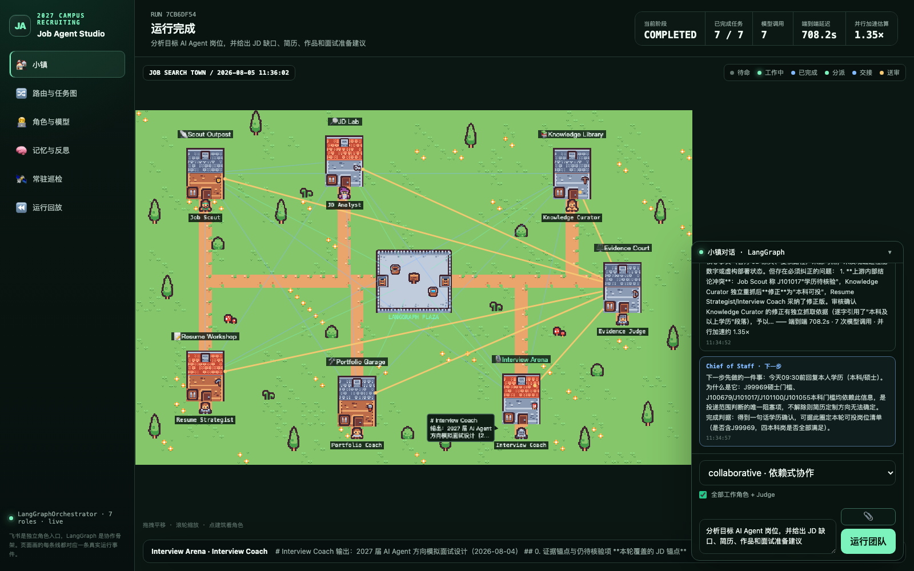

# Job Multi-Agent Town

一个多 Agent 求职助手。**你用一句话下指令，一支分工明确的 Agent 团队把它做完**，
过程中的每条证据、每次交接、每个结论都写进事件流，可以逐帧回放。

三个入口都能下指令：飞书机器人、网页控制台、HTTP API。推理走 Anthropic 官方 SDK
调 Claude，也保留一条 OpenAI-compatible 自建端点旁路。



上图是一次真实运行结束时的控制台，不是设计稿也不是预录动画。橙色连线是事件流里
真实的证据交接方向，右侧是本轮 Evidence Judge 的实际审核结论。
**页面拿不出对应事件的连线，页面就不画。**

## 它解决什么问题

你看到一个岗位，想知道：这岗位是真的吗、我够不够格、简历要怎么改、作品还缺什么、
面试该准备什么。

单个聊天机器人会一次性给你一段读起来很顺的建议——但它没核验过那个招聘页面是否
真的存在，不知道学历要求会不会卡你，也不会告诉你哪句话只是它推断出来的。

这个项目把这件事拆开：

- 每个环节交给一个专职 Agent，各自只做自己那段，把证据显式交接给下游；
- 最后由 **Evidence Judge** 逐条核对来源，删掉没有出处的说法，标出角色之间的冲突；
- 全过程持久化成事件，所以任何一次运行都能回放，看清「这句结论是谁、基于什么证据
  说出来的」。

它不替你决定投哪个岗位。它负责让你手上的结论有出处。

## 快速开始

```bash
uv sync --extra dev
cp .env.example .env      # 填入 ANTHROPIC_API_KEY
uv run job-agent-api
```

打开 `http://127.0.0.1:8000`，在对话框里输入你的指令。

没配模型 API 时接口会明确报配置缺失，不会静默假装成功。单元测试全部使用 Mock
Model，不消耗模型额度：

```bash
uv run pytest
```

## 怎么给它下指令

### 1. 网页控制台

输入框里直接写自然语言，例如：

```text
帮我看看这个 JD 要求什么，我的简历该怎么改
分析这个 AI Agent 岗位并制定面试准备
```

Chief of Staff 先把请求拆成最多 3 个子任务再派单，所以一句话通常只唤起一到两个角色，
而不是所有关键词沾边的角色。也可以贴图（JD 截图、简历截图），一次最多 9 张。

要跑完整的每日流程，用 `/today`（不带参数即可）：四个角色分阶段协作，核验今日岗位 →
拆解最优先那个的要求与缺口 → 出简历与作品动作 → 出模拟面试题，最后由 Evidence Judge
核对来源。实测约 6-7 分钟、6 次模型调用。

### 2. 飞书机器人

```bash
export LARK_APP_ID=cli_xxx
export LARK_APP_SECRET=...
export ANTHROPIC_API_KEY=...
uv run job-agent-feishu
```

群里必须 `@Chief of Staff`——飞书只在机器人被点名时才推送群消息，`@所有人` 是 at_all，
点不到机器人，那条消息服务端根本收不到。单聊里直接发命令即可。

普通消息由 Chief of Staff 拆解后派单；下面这些命令可以显式指定要谁干活（会跳过拆解）：

| 命令 | 做什么 |
|---|---|
| `/help` | 查看帮助，不调用模型 |
| `/roles` | 查看当前角色，不调用模型 |
| `/today` | **今日求职流程，不用带参数**。4 个角色分阶段跑完整套 |
| `/job <任务>` | 岗位侦察 + 岗位分析，分阶段协作 |
| `/apply <任务>` | 岗位分析先行，再产出简历与作品材料 |
| `/interview <任务>` | 岗位分析先行，再产出面试准备 |
| `/team <任务>` | 4 个工作角色分阶段协作（你给任务；不给任务用 `/today`） |
| `/knowledge <任务>` | 只让 Job Analyst 拆解岗位要求与所需知识 |
| `/ask <role_id> <问题>` | 向指定角色单独提问（`/agent` 是别名） |
| `/mock start <主题> [语音] [N轮]` | 进入一问一答的实时模拟面试 |
| `/mock skip` / `/mock status` / `/mock end` | 跳过本题／看进度／收尾复盘 |
| `/daily` | 推送今天的结构化日报（可加日期或 `full`） |
| `/role-add <JSON>` | 新增并立即启用一个角色 |
| `/group-create` | 由总控创建并绑定私有 Agent 小镇群 |

直接发图片也可以：Chief of Staff 会先把图里可见内容照抄成文字证据（看不清的写
「图中不可辨认」），再交给角色处理。

### 3. HTTP API

```bash
curl -X POST http://127.0.0.1:8000/api/runs \
  -H 'Content-Type: application/json' \
  -d '{"query":"分析这个 AI Agent 岗位并给出简历修改建议","mode":"collaborative"}'
```

`mode` 可选 `single`（单角色）、`parallel`（并行）、`sequential`（串行）、
`collaborative`（分阶段协作）；`requested_roles` 可显式指定角色，留空则自动路由。

## 下完指令能看到什么

侧边栏六个页面，页码记在 URL hash 里，`#patrol` 这样的链接可以直接发给别人：

| 页面 | 看什么 |
|---|---|
| `#town` | 小镇总览：谁在干活、气泡说了什么、证据往哪交接 |
| `#graph` | 本轮任务被拆成哪些节点、依赖关系、验收条件、各节点用的模型与进度 |
| `#roles` | 每个角色的阶段、模型和真实耗时，可就地改模型或暂停角色 |
| `#memory` | 每个角色的长期记忆流与重要度 |
| `#patrol` | 常驻巡检的在岗状态、上轮几秒前、连续失败几次 |
| `#replay` | 历史运行列表，可选任意一次按事件时间步回放 |

回放只显示到所选时间步为止的事件，不显示「未来」。

## 团队里都有谁

Chief of Staff 先拆解任务并决定派谁，被选中的角色再按
`route → discovery → analysis → action → judge` 推进，由 LangGraph 状态图编排：

| 角色 | `role_id` | 阶段 | 模型 · effort | 工具 | 负责 |
|---|---|---|---|---|---|
| Chief of Staff | `controller` | 拆解／接单／收口 | Sonnet 5 · low | — | 把请求拆成最多 3 个子任务并说明派谁、为什么；读图转写；最后给一句下一步 |
| Job Scout | `job_scout` | discovery | Sonnet 5 · medium | 搜索 + 抓取 | 发现并核验岗位，给出可访问的官方来源与截止时间 |
| Job Analyst | `job_analyst` | analysis | **Opus 5** · high | 搜索 + 抓取 | 把 JD 拆成硬要求、加分项、关键词与缺口，并把缺口涉及的概念、技术栈、工程难点讲到能面试的深度 |
| Material Builder | `material_builder` | action | Sonnet 5 · medium | 读岗位表 | 选简历版本改写量化 bullet；把缺口转成可展示的作品动作与验收指标 |
| Interview Coach | `interview_coach` | action | Sonnet 5 · medium | 仅资料包 | 生成问题、追问、评分标准和学习任务 |
| Evidence Judge | `judge` | judge | **Opus 5** · high | 仅抓取（核验） | 核对来源与冲突，删掉不可验证的说法 |

工具是按职责给的，不是按等级给的。Judge 只有「抓取」没有「搜索」——它能真的打开上游
引用的链接去核验，但不能自己去找新岗位，那会违反它「只保留上游支持的事实」的契约。
Interview Coach 什么联网工具都没有，因为给它搜索只会招来假冒的「公司真题」。

模型和 effort 也按任务性质分：拆解、读图、收口是路由和转写，不需要推理深度，跑
`low`；工具循环和受约束改写跑 `medium`；只有真正要推理的两个角色（讲清概念、交叉核对
证据）上 Opus + `high`。

角色是数据不是硬编码的图节点：`workflow_stage` 决定它在流程里的位置，通过网页表单、
`POST /api/roles` 或 `/role-add` 新增角色即时生效，不改代码不重启。单个角色失败不
阻塞整体，Judge 会基于已完成的结果出部分报告；超时和连接错误一律进事件流并在页面
上显示。

Evidence Judge 只在需要时出场：多个角色的产出要交叉核对时一定审，单个角色回答一个
明确问题时由拆解决定要不要审。拆解本身失败（超时、返回的不是 JSON）会退回关键词
路由，事件流里会写明是哪一种路由做的决定。

## 常用配置

完整清单见 `.env.example`。最常改的几项：

```dotenv
ANTHROPIC_API_KEY=...
JOB_AGENT_MODEL=claude-sonnet-5                             # 默认模型
JOB_AGENT_KNOWLEDGE_MODEL=claude-opus-5                     # 需要更强推理的角色
JOB_AGENT_ROLE_MODEL_JOB_ANALYST=claude-opus-5              # 只改某一个角色
JOB_AGENT_ORCHESTRATOR=asyncio                              # 切到轻量 baseline 编排器
JOB_AGENT_ALWAYS_ON=1                                       # 常驻巡检
JOB_AGENT_DAILY_PUSH=1                                      # 每日日报定时推送
JOB_AGENT_CHIEF_PLANNER=0                                   # 关掉任务拆解，退回关键词路由
```

模型解析顺序是 `网页/API 的 RoleSpec.model` > `JOB_AGENT_ROLE_MODEL_<ROLE_ID>` >
`model_profile` 默认模型，所以可以只给某一个角色换模型做 A/B。网页的角色卡也能直接改。

**调整目标岗位范围**：每个角色的目标写在 `configs/roles.json` 的 `system_prompt` 里。
默认的 Job Scout 提示词限定了特定届别的正式校招（不含实习、社招、海外），如果你的
目标不同，改这里再同步：

```bash
uv run job-agent-roles-sync    # 把 configs/roles.json 的提示词推到运行时注册表
```

## 让它自己干活

Job Scout 不等你 `@` 也在工作：常驻巡检定期核验岗位，心跳写进事件流。

```bash
uv run job-agent-watch                      # 独立进程跑常驻巡检
curl -s localhost:8000/api/always-on        # 在不在岗、上轮几秒前、连续失败几次
uv run job-agent-push-daily                 # 手动推一次日报
```

API 服务自己也会起同一个巡检和日报定时器，两边抢同一把文件锁，同时开着不会跑双份。
日报定时是轮询而不是睡到某一刻：笔记本合盖睡过了推送时间，醒来仍会在窗口内补推，
超窗则跳过当天。

## 内部实现与验证

长期记忆可以直接审计，检索质量有可重跑的量化基线：

```bash
curl http://127.0.0.1:8000/api/agents/job_analyst/memories
uv run python benchmarks/eval_memory_retrieval.py
```

- [`docs/architecture.md`](docs/architecture.md)：开源调研、调用链、读取路径与检索设计
- [`docs/rpg-agent-town.md`](docs/rpg-agent-town.md)：小镇页面的状态映射
- [`docs/performance-report.md`](docs/performance-report.md)：编排开销与模型 A/B 实测
- [`benchmarks/README.md`](benchmarks/README.md)：检索基线的数据集与指标
- [`docs/feishu-deployment.md`](docs/feishu-deployment.md)：飞书后台配置与容器部署
- [`docs/feishu-multi-bot.md`](docs/feishu-multi-bot.md)：给每个角色配独立机器人身份
- [`docs/asset-credits.md`](docs/asset-credits.md)：瓦片素材与前端库的来源与许可

前端零构建：`web/` 是静态文件，由 FastAPI 直接挂载，没有 npm/Vite/TypeScript 步骤。

## 部署

附带 `Dockerfile` 和 `compose.yaml`。GitHub Pages 只能托管静态页面，跑不了 Agent
后端，常驻机器人需要一个长期运行的 Python 服务：

```bash
docker compose up --build -d bot                 # 只跑飞书长连接机器人
docker compose --profile api up --build -d       # 机器人 + API/UI
```
