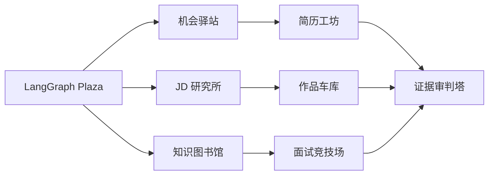

# RPG 求职 Agent 小镇

## 目标

可视化借鉴 [Generative Agents](https://github.com/joonspk-research/generative_agents)
的“小镇 + 角色活动”表达，但使用本项目原创的 HTML/CSS 精灵、建筑和求职语义。
Generative Agents 更强调角色记忆、反思、计划和社会互动；本项目的小镇首先是
真实工作流观测器，不伪装成自主生活模拟。

## 小镇映射

| 建筑 | role_id | LangGraph 阶段 |
| --- | --- | --- |
| 机会驿站 | `job_scout` | context |
| JD 研究所 | `jd_analyst` | context |
| 知识图书馆 | `job_knowledge_curator` | context |
| 简历工坊 | `resume_strategist` | action |
| 作品车库 | `portfolio_coach` | action |
| 面试竞技场 | `interview_coach` | action |
| 证据审判塔 | `judge` | judge |
| LangGraph Plaza | 调度中心 | route |



## 真实状态来源

编排器把以下事件追加到 `data/runtime/activity.jsonl`：

- `run_started`、`route_completed`、`phase_started`
- `handoff_created`（上游 Agent 向下游 Agent 交接证据）
- `agent_started`、`agent_completed`
- `run_completed`、`run_failed`

网页每 1.5 秒读取 `/api/activity`。`queued` 精灵聚集在 Plaza，`running` 精灵移动到
自己的建筑并显示输出气泡，`ok/error/timeout` 使用不同颜色。点击建筑可固定查看
模型、延迟、角色日程与最近记忆。小镇时间线显示真实阶段、Agent 输出和
context → action 的证据交接；`/api/town` 把 ActivityEvent 投影成每个角色的当前
行动、计划和记忆流。API Key 与 App Secret 从不写入事件。

## 本地演示

```bash
uv run job-agent-api
open http://127.0.0.1:8000
```

在网页输入任务并选择 `collaborative`，可观察：

1. route 选择角色；
2. 三个 context Agent 并行；
3. 三个 action Agent 基于上游证据并行；
4. Judge 完成证据审查；
5. 历史运行表保留模型、耗时和结果；
6. 点击建筑查看该角色从过往运行形成的记忆流。

GitHub Pages 只能展示静态说明；要让小镇实时运行，需要 FastAPI Runtime 和模型 API。
部署时可直接使用仓库的 Dockerfile。
