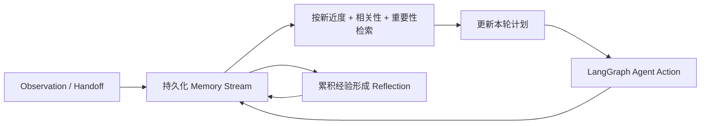
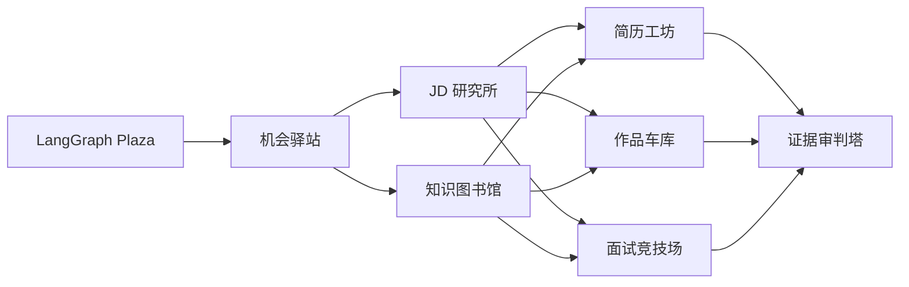

# RPG 求职 Agent 小镇

## 目标

可视化借鉴 [Generative Agents](https://github.com/joonspk-research/generative_agents)
的“小镇 + 角色活动”表达，但使用本项目原创的 HTML/CSS 精灵、建筑和求职语义。
Generative Agents 的核心是 observation、planning、reflection 与动态记忆检索。
本项目把这套机制改写成求职工作流：角色不会模拟吃饭睡觉，而是围绕真实任务形成
长期记忆、更新计划、交接证据并反思失败；网页仍然只展示真实运行状态，不播放
伪造的预录动画。

## 生成式认知循环



- `observation`：角色输出或失败结果；
- `handoff`：Context Agent 交给 Action Agent 的证据；
- `plan`：根据角色日程和当前任务生成的本轮行动计划；
- `reflection`：每累积若干条 observation/handoff 后形成的高层经验；
- retrieval score：`0.38 × recency + 0.40 × relevance + 0.22 × importance`。

记忆保存在权限为 `0600` 的 append-only `data/runtime/memories.jsonl`，不会写入
API Key 或 App Secret。反思采用确定性摘要，不产生隐藏推理，也不会额外消耗模型
额度。检索到的记忆会进入角色 prompt，模型必须把过时信息标成待重新核验。

## 小镇映射

| 建筑 | role_id | LangGraph 阶段 |
| --- | --- | --- |
| 机会驿站 | `job_scout` | discovery |
| JD 研究所 | `jd_analyst` | analysis |
| 知识图书馆 | `job_knowledge_curator` | analysis |
| 简历工坊 | `resume_strategist` | action |
| 作品车库 | `portfolio_coach` | action |
| 面试竞技场 | `interview_coach` | action |
| 证据审判塔 | `judge` | judge |
| LangGraph Plaza | 调度中心 | route |



## 真实状态来源

编排器把以下事件追加到 `data/runtime/activity.jsonl`：

- `run_started`、`route_completed`、`phase_started`
- `task_graph_created`、`task_started`、`task_completed`
- `handoff_created`（上游 Agent 向下游 Agent 交接证据）
- `memory_retrieved`、`plan_updated`、`reflection_created`
- `agent_started`、`agent_completed`
- `run_completed`、`run_failed`

网页每 1.5 秒读取 `/api/activity`、`/api/town` 和任务图。`queued` 精灵聚集在
Plaza，`running` 精灵移动到
自己的建筑并显示输出气泡，`ok/error/timeout` 使用不同颜色。点击建筑可固定查看
模型、延迟、角色日程、阶段反思与长期记忆。小镇时间线显示真实阶段、Agent 输出和
discovery/analysis → action 的证据交接；`/api/town` 把 ActivityEvent 与 Memory Stream
投影成每个角色的当前行动、计划和记忆流。API Key 与 App Secret 从不写入事件。

工具栏可选择任一历史 run，并用时间步滑杆逐事件回放。回放调用
`/api/town?run_id=<run>&step=<n>`，只使用该 run 截至第 n 条的真实
ActivityEvent；角色会按当时状态在 Plaza、自己的建筑与 Judge 路径间移动。历史
回放不注入“未来”长期记忆，也不会编造对话或状态。

## 任务拆解、依赖与进度

页面的任务面板读取 `/api/task-graphs`，按阶段显示真实 DAG：

- `DAILY DELIVERY`：总控日报与七角色分发；
- `DISCOVERY`：岗位侦察；
- `ANALYSIS`：JD 与岗位知识；
- `ACTION`：简历、作品与面试；
- `JUDGE`：证据审核。

每张任务卡展示任务详情、`depends_on`、三条验收标准、模型、状态和进度。上游未完成
时显示 `blocked`；角色开始工作时为 `running/50%`；完成、超时或错误后写入最终
状态。历史回放会把任务图投影到所选事件时间步，不会把最后的 100% 状态泄露到早期
步骤。

## 动态角色与建筑

网页“角色工作台”支持：

1. 从生信算法、数据科学、Agent 评测模板一键创建角色；
2. 自定义 role ID、目标、prompt、触发词、工作阶段、建筑、图标和日程；
3. 即时暂停或重新启用角色；
4. 新角色无需重启即可进入 LangGraph 路由和小镇。

`workflow_stage=context` 的动态角色进入分析层生产证据；`workflow_stage=action`
的角色接收 discovery/analysis handoff 后行动；`judge` 保持最后审核。内置
`job_scout` 单独位于 discovery。运行时注册表升级会只补齐新字段，不
覆盖用户已修改的名称、目标或 prompt。

## 本地演示

```bash
uv run job-agent-api
open http://127.0.0.1:8000
```

在网页输入任务并选择 `collaborative`，可观察：

1. route 选择角色；
2. 岗位侦察员先完成 discovery；
3. JD 与岗位知识 Agent 并行分析；
4. 三个 action Agent 在依赖满足后并行；
5. Judge 完成证据审查；
6. 任务面板显示依赖、验收标准和进度；
7. 历史运行表保留模型、耗时和结果；
8. 点击建筑查看该角色从过往运行形成的记忆流；
9. 从小镇工具栏选择历史 run，拖动滑杆逐步回放路由、工作、交接和审核。

GitHub Pages 只能展示静态说明；要让小镇实时运行，需要 FastAPI Runtime 和模型 API。
部署时可直接使用仓库的 Dockerfile。
